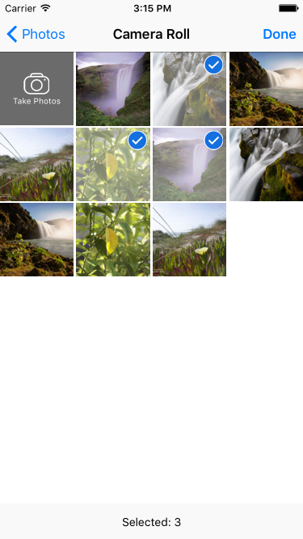

# BUKImagePickerController

[](https://travis-ci.org/iException/BUKImagePickerController)
[](http://cocoapods.org/pods/BUKImagePickerController)
[](http://cocoapods.org/pods/BUKImagePickerController)
[](http://cocoapods.org/pods/BUKImagePickerController)

BUKImagePickerController is a view controller that allows the user picking multiple assets from the photo libray or capturing images with a camera. It looks like the system built-in component UIImagePickerController at first glance . However, BUKImagePickerController is more powerful. Run the example project to take a tour.



## Usage

### Basic

It's super easy to use BUKImagePickerController. The normal approach is:

1. Implement `BUKImagePickerControllerDelegate` methods.
2. Simply create a `BUKImagePickerController` instance.
3. Set its delegate and configure it according to you actual needs.
4. Show the image picker controller.

``` obj-c

BUKImagePickerController *imagePickerController = [[BUKImagePickerController alloc] init];
imagePickerController.mediaType = BUKImagePickerControllerMediaTypeImage;
imagePickerController.sourceType = BUKImagePickerControllerSourceTypeLibrary;
imagePickerController.delegate = self;
imagePickerController.allowsMultipleSelection = YES;
[self presentViewController:imagePickerController animated:YES completion:nil];

```

In your delegate:

``` obj-c

- (void)buk_imagePickerController:(BUKImagePickerController *)imagePickerController didFinishPickingAssets:(NSArray *)assets {
    // Process assets

    [imagePickerController dismissViewControllerAnimated:YES completion:nil];
}

```


### Advanced

Run the example project and see the [full documentation](BUKImagePickerController/Classes/BUKImagePickerController.h) for more details.


## Requirements

* iOS 7.0 and later
* ARC


## Installation

BUKImagePickerController is available through [CocoaPods](http://cocoapods.org). To install
it, simply add the following line to your Podfile:

``` ruby
pod "BUKImagePickerController"
```


## Credits

Inspired by [QBImagePicker](https://github.com/questbeat/QBImagePicker)


## Author

Yiming Tang, [@yiming_t](https://twitter.com/yiming_t)


## License

BUKImagePickerController is available under the MIT license. See the LICENSE file for more info.
